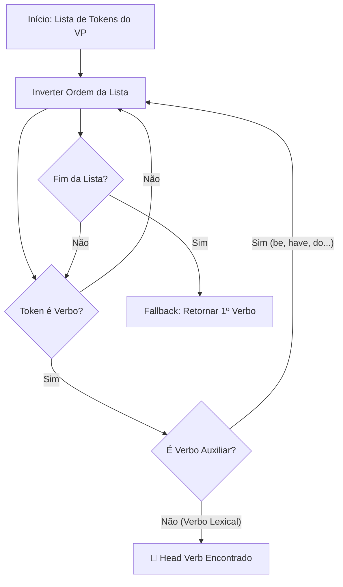

````markdown
# 🚀 FEATURE: VP Analysis & Head Verb Identification

## 🌿 Branch de Desenvolvimento
`feature/vp-analysis` (Merged into `main`)

## 🎯 Objetivo da Funcionalidade
Enquanto o requisito *core* do projeto foca na análise estrutural profunda de **Noun Phrases (NPs)** utilizando *Context-Free Grammars* (CFG), esta funcionalidade extra implementa uma camada de **Shallow Parsing** (análise superficial) focada em **Verb Phrases (VPs)**.

O objetivo é extrair a ação central da frase e identificar o seu núcleo semântico (**Head Verb**), permitindo uma compreensão mais rica de "quem fez o quê", essencial para tarefas de *Information Extraction*.

---

## ⚙️ Implementação Técnica

A funcionalidade foi arquitetada de forma modular e integrada no `parser.py` através da função `vp_chunk_feature`. A implementação distingue-se da lógica principal para demonstrar versatilidade no uso de técnicas de NLP.

### 1. Abordagem Híbrida
A análise de VPs utiliza uma combinação de:
* **POS Tagging:** Uso do `averaged_perceptron_tagger` do NLTK para classificar gramaticalmente as palavras.
* **Regular Expression Chunking:** Uso do `nltk.RegexpParser` para identificar padrões lineares.

### 2. Gramática de Chunking
Utilizamos a seguinte regra de expressão regular para capturar cadeias verbais complexas e os seus modificadores imediatos:

```python
VP: {<VB.*>+<RB.?>*<RP>?<DT|NN.*>?}
````

  * `<VB.*>+`: Captura um ou mais verbos consecutivos (ex: "sat", "had been sitting").
  * `<RB.?>*`: Captura advérbios opcionais que modificam o verbo (ex: "quickly", "never").
  * `<RP>?`: Captura partículas verbais (ex: "up" em "give up").
  * `<DT|NN.*>?`: Captura opcionalmente o início de um objeto direto para contexto (Lookahead).

### 3\. Algoritmo de Identificação do Head Verb (Lógica Heurística)

Para determinar qual palavra carrega o significado principal dentro de um VP complexo (ex: distinguir o auxiliar "is" do núcleo "walking"), utilizamos um algoritmo de filtragem reversa.

#### 🔄 Fluxo de Decisão:



**Regras do Algoritmo:**

1.  **Iteração Reversa:** Analisa os verbos do chunk de trás para a frente.
2.  **Filtragem de Auxiliares:** Ignora verbos que funcionam puramente como auxiliares gramaticais (Lista de exclusão: *be, is, are, was, were, have, has, had, do, did*, etc.).
3.  **Seleção:** O último verbo lexical (não-auxiliar) encontrado é marcado como o núcleo.

-----

## 📊 Exemplos de Processamento

### Exemplo 1: Verbo Simples

> **Frase:** "Holmes **sat** in the red armchair."

  * **VP Chunk:** `sat`
  * **Head Verb:** `sat`

### Exemplo 2: Verbo Composto (Tempo Perfeito)

> **Frase:** "He **had arrived**."

  * **VP Chunk:** `had arrived`
  * **Head Verb:** `arrived` (O auxiliar "had" é filtrado).

### Exemplo 3: Verbo com Advérbio e Partícula

> **Frase:** "Holmes **sat down**."

  * **VP Chunk:** `sat down`
  * **Head Verb:** `sat`

-----

## 🚀 Como Testar

Esta feature é executada automaticamente pelo `parser.py`. O output é exibido numa secção dedicada após a árvore CFG:

```text
[REQ. 2: FEATURE EXTRA - VP ANALYSIS]
  - VP: 'had arrived' | Head Verb: 'arrived'
```

````

---
````

### 2. Ficheiro `README.md` (Melhorado)

# 🤖 CS50 AI: Parser com Extensão VP

Este projeto implementa um analisador sintático (Parser) de linguagem natural capaz de interpretar a estrutura gramatical de frases em inglês, utilizando a biblioteca **NLTK**.

## 📋 Funcionalidades

### 1. Core (Requisitos CS50)
* **Context-Free Grammar (CFG):** Definição formal de regras sintáticas (`NONTERMINALS` e `TERMINALS`) capaz de gerar árvores sintáticas completas.
* **Parsing:** Geração de árvores utilizando `nltk.ChartParser`.
* **NP Chunking:** Algoritmo de travessia de árvore (Tree Traversal) para identificar e extrair Frases Nominais (NPs) que não contêm outras NPs aninhadas.

### 2. Feature Extra (Inovação)
* **VP & Head Verb Analysis:** Um módulo adicional desenvolvido na branch `feature/vp-analysis`.
* Utiliza **Shallow Parsing** (Regex + POS Tagging) para identificar Frases Verbais.
* Aplica uma heurística para isolar o **verbo principal** (núcleo da ação), ignorando auxiliares.
* 📄 **Documentação Completa:** [FEATURE_VP_CHUNKING.md](FEATURE_VP_CHUNKING.md)

---

## 🚀 Como Executar

### 1. Instalação
Certifique-se de que tem o Python instalado. Instale as dependências:

```bash
pip install -r requirements.txt
````

### 2\. Execução

Execute o parser passando o diretório das frases como argumento:

```bash
python parser.py sentences
```

*(O script fará o download automático dos recursos `punkt` e `averaged_perceptron_tagger` do NLTK na primeira execução).*

-----

## 📂 Estrutura de Arquivos

```text
.
├── parser.py                # Código fonte (CFG + Feature VP)
├── sentences/               # Diretório com corpus de teste (1.txt a 10.txt)
├── requirements.txt         # Dependências do projeto
├── README.md                # Este ficheiro
└── FEATURE_VP_CHUNKING.md   # Documentação técnica da Feature Extra
```

## ✒️ Autoria

Projeto desenvolvido no âmbito do curso CS50 Introduction to Artificial Intelligence with Python.

```
```